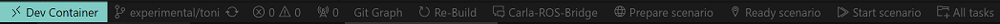
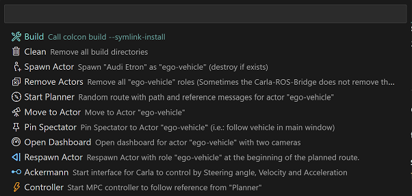

# Carla-ROS-Framework

First steps to a simulation environement with [Carla](https://carla.org/) and [ROS2](https://docs.ros.org/en/rolling/index.html).


## Installation

Within your [WLS](https://learn.microsoft.com/en-us/windows/wsl/setup/environment) command-line interface, clone the [repository](https://bitbucket.efs-techhub.com/scm/at01447/carla_simulation_pipeline.git) and open a remove session with [Visual Studio Code](https://code.visualstudio.com/):

```sh
cd ~/
git clone -b experimental/toni https://bitbucket.efs-techhub.com/scm/at01447/carla_simulation_pipeline.git carla_ros_framework

cd carla_ros_framework
code .
```

[Visual Studio Code](https://code.visualstudio.com/) now establishes a remote session to this directory. Here, you will be asked to `Reopen in Container` in the bottom right corner. If use miss it, press `CTRL+SHIFT+P` and search for it, to evoke the command yourself.

> This environment now contains [ROS2 Foxy](https://docs.ros.org/en/foxy/Releases/Release-Foxy-Fitzroy.html) and [ROS/ROS2 bridge for CARLA simulator](https://github.com/carla-simulator/ros-bridge) to work with.

Within **Windows**, you need to install [Carla](https://github.com/carla-simulator/carla/releases) by downloading [CARLA_0.9.14.zip](https://carla-releases.s3.eu-west-3.amazonaws.com/Windows/CARLA_0.9.14.zip) and unpacking it into your *favorite* directory.

## How to

This section contains all the steps to get an *exemplary* simulation running.

### Start Carla within Windows

Start the `CarlaUE4.exe`. You can specify the *resolution* and *quality* if needed with `-ResX=200 -ResY=100 --quality-level=Low`

### Start all necessary tasks from the ROS/ROS2 bridge for CARLA simulator and this Repository

With the building of the [devcontainer](.devcontainer/devcontainer.json), a plugin called [Task Buttons](https://marketplace.visualstudio.com/items?itemName=spencerwmiles.vscode-task-buttons) was installed. This plugin adds buttons for configurable tasks to the **status bar** at the bottom of [Visual Studio Code](https://code.visualstudio.com/).



- **Re-Build** - Remove all build folders and [build](https://docs.ros.org/en/eloquent/Installation/Linux-Development-Setup.html) packages
- **Carla-ROS-Bridge** - Start [Carla-ROS-Bridge](https://github.com/carla-simulator/ros-bridge)
- **Prepare senarico** - Load a [Map](https://carla.readthedocs.io/en/latest/core_map/) and spawn the [Actors](https://carla.readthedocs.io/en/latest/core_actors/) for the *scenario*
- **Ready scenario** - Start the [Planner](src/planner), move the [Spectator](https://carla.readthedocs.io/en/latest/tuto_G_getting_started/#the-spectator) to the *ego_vehicle* and start the [Dashboard](src/dashboard/)
- **Start scenario** - Start the [Model-Predictive-Controller](src/controller/) with the [Ackermann-Interface](https://carla.readthedocs.io/projects/ros-bridge/en/latest/carla_ackermann_control/) from the [Carla-ROS-Bridge](https://github.com/carla-simulator/ros-bridge)

> Currently, all tasks are **hardcoded** for single *scenario* with the same *vehicle*.

All tasks, that are called via the *collective tasks* mentioned above, can be called separately via the **All tasks** task-button:


